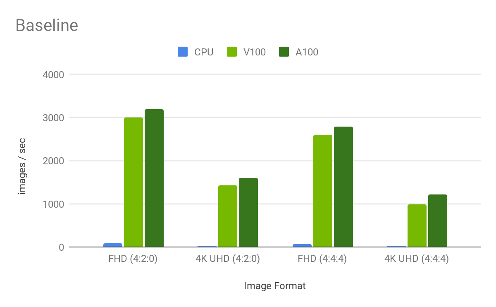
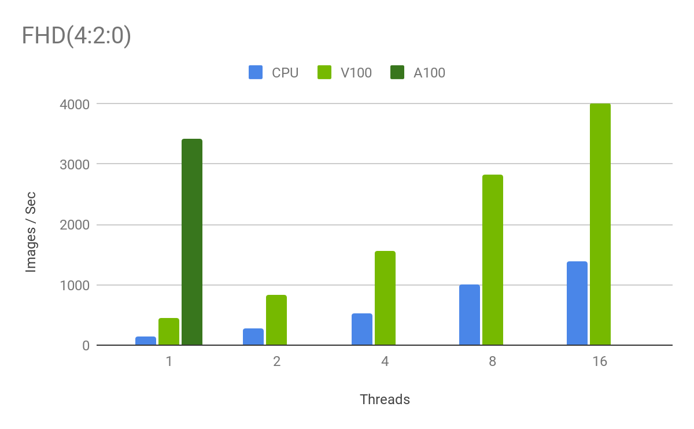
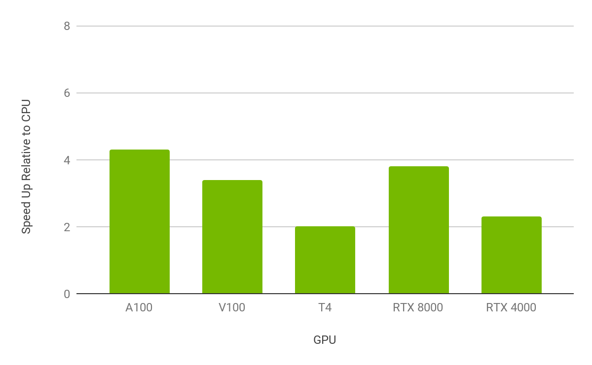
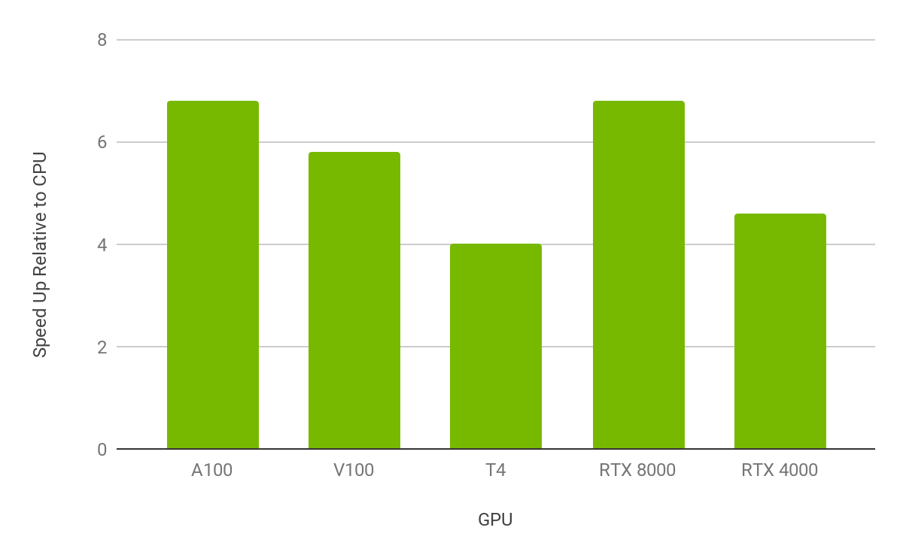

# PyNvJpeg

## 一、概述
<br>
本仓库是为了加速机器学习过程中读写图像(即编解码)的效率. 基本思路是使用NVIDIA GPU加速图像的编解码过程, NVIDIA官方也提供了名为nvjpeg/nvjpeg2000的库用于加速JPEG和JPEG2000格式的图像编解码. 遗憾的是:

- nvjpeg/nvjpeg2000仅支持JPEG/JPEG2000格式的图像编解码;
- nvjpeg/nvjpeg2000均仅提供C/C++的动态链接库, 不提供Python API；

<br>
所幸的是，NVIDIA DALI库提供了对于JPEG/JPEG2000格式图像的封装，且同时同时支持C++和Python调用方式。此外，其还封装了nvTIFF支持对TIFF格式图像编解码的加速. 对于其它格式的图像DALI回退使用OpenCV编解码. 如此以来, DALI将支持大部分主流图像格式, 如JPG, BMP, PNG, TIFF, PNM, PPM, PGM, PBM, JPEG 2000, WebP等.

NVIDIA DALI定位于服务图像的加载和预处理，主要用于深度学习训练、模型推理等. 因此，其为提供图像编码的函数。

<br>
本仓库思路如下：
- 解码: 使用Python代码对NVIDIA DALI进行包装;
- 编码: 使用PyBind11对nvjpeg进行封装, 支持RGB(HWC)/BGR(HWC)/RGBP(CHW)/BGRP(CHW)格式图像的快速编码;

<br>

## 二、GPU编解码性能测试
<br>

<p align="center">
  
&nbsp; &nbsp; &nbsp; &nbsp;
  
</p>

<br>

- 左图: Speed up achieved by hardware decode on A100 compared to CUDA decode on V100 and CPU only decode.
- 右图: JPEG Baseline encoding throughput comparison between CPU, and V100 and A100 GPUs for common image sizes and formats.
- CPU: Intel Xeon Platinum 8168@2GHz 3.7GHz Turbo (Skylake) HT On


<br><br>

<p align="center">
  
&nbsp; &nbsp; &nbsp; &nbsp;
  
</p>

<br>

- 左图: Lossless: 5-3 wavelet transform
- 右图: Lossy: 9-7 wavelet transform
- CPU: Intel Xeon Gold 6240@2GHz 3.9GHz Turbo (Cascade Lake) HT On


## 三、代码示例
```python
import nvjpeg
import numpy as np

img_path = "../images/proposer.jpg"
nj       = nvjpeg.JpegCoder()

# 1. 读取图像
img      = nj.imread(img_path, format=nvjpeg.nvjpegOutputFormat.BGR)

# 2. 使用buffer解码
img_np   = np.fromfile(img_path, dtype=np.uint8)
img      = nj.imdecode(img_np, format=nvjpeg.nvjpegOutputFormat.BGR)

# 3. 图形编码
img_cv2_bgr     = cv2.imread(img_path,      cv2.IMREAD_COLOR)
img_torch_bgr   = torch.from_numpy(img_cv2_bgr).to("cuda")
bytes_nj        = nj.imencode(img_torch_bgr, format=nvjpeg.nvjpegInputFormat.BGR)

# 4. 编码且写入文件
status          = nj.imwrite("nj_bgr.jpg",  img_torch_bgr,  format=nvjpeg.nvjpegInputFormat.BGR)


# 5. 其它
print(nj.version())                       # 查看nvjpeg的版本信息
print(nj.shape(img_path))                 # 查看图像的形状信息
print(nj.shape(img_np))
img_torch   = torch.from_numpy(img_np)
print(nj.shape(img_torch))
```


## 四、环境需求
<br>

### 4.1 System
- Linux Only

### 4.2 Software
- numpy >= 1.7
- pytorch-cuda
- nvidia-dali-cuda110
- gcc
- cuda >= 11.0
- cuda driver >= 455


### 4.3 Python库依赖
<br>

```
setuptools
numpy
typing
torch
nvidia-dali-cuda110
```

*注意:* nvidia dali的安装参考: https://docs.nvidia.com/deeplearning/dali/user-guide/docs/installation.html

## 五、 安装
<br>

```bash
git clone http://code.hq.cpic.com/GP21AIMMS/pynvjpeg
cd  PyNvJpeg

python setup.py install 
```

## 六、作者信息
<br>
@Copyright  杨现   2023.05.06

## 七、参考文档
<br>

1. NVIDIA库的使用示例:   https://github.com/NVIDIA/CUDALibrarySamples/tree/master
2. NVIDIA DALI官方文档: https://docs.nvidia.com/deeplearning/dali/user-guide/docs/index.html
3. NVIDIA DALI官方仓库: https://github.com/NVIDIA/DALI
4. NVJPEG官方主页:      https://developer.nvidia.com/nvjpeg
5. NVJPEG官方文档:      https://docs.nvidia.com/cuda/nvjpeg/index.html
6. PyBind11官方文档:    https://pybind11.readthedocs.io/en/stable/upgrade.html
7. ChatGPT:            https://chat.openai.com/?model=text-davinci-002-render
